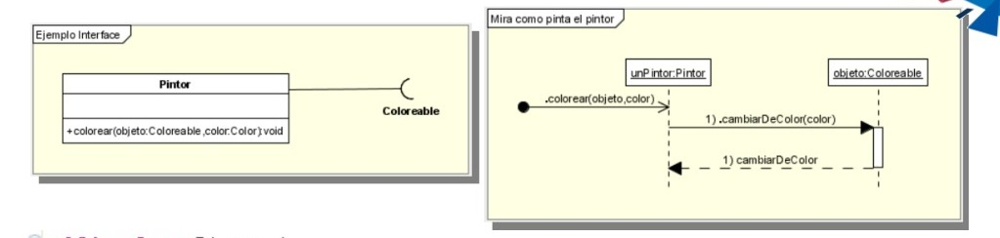
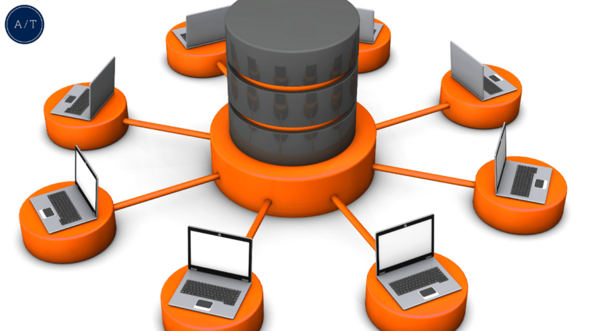
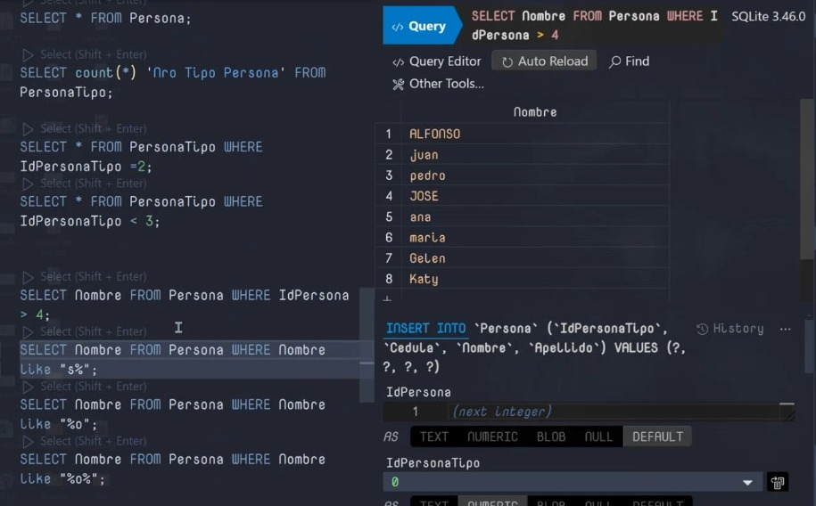
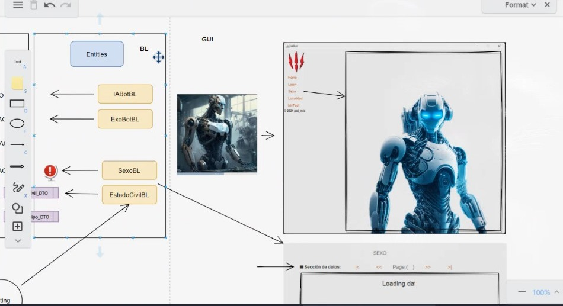
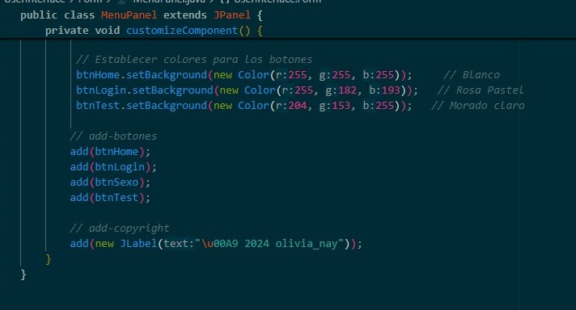

# **Cuaderno de apuntes**
**Mateo Molina**
**Gr6cc**


### ***Programación II***

**Realización:**

***--Interfaces--***

- **Definición de Interfaz:**

Una interfaz es un conjunto de métodos abstractos (sin implementación) que una clase puede implementar. La interfaz también puede contener constantes (valores finales) y métodos predeterminados con implementación.

 ------O  /    ------> 
 
 En vez de utilizar la flecha de la interface, también se puede usar una especie de chupete junto con el nombre de la interface.

- La flecha de la interface es una linea entrecortada y con la cabeza tal como es en la herencia pero con la diferencia que la flecha siempre apunta desde la clase a la interface.


- El nombre de la interface va de esta manera : ==IMaquinaDeEscribir==

 ```java 
public interface IMaquinaDeEscribir {
       public void teclazo();
}
```
 - Se puede implementar una o varias interfaces.
  
 ```java   
public class Teclado implements IMaquinaDeEscribir {
       public void teclazo(){
              system.out.println ( "TECLADAZO....");
       }
}
```

- **Sintaxis Básica:**
La sintaxis para declarar una interfaz en Java es la siguiente:
```java
public interface INombreDeLaInterfaz {
    // Declaración de constantes (opcional)
    int CONSTANTE = 10;

    // Métodos abstractos (sin implementación)
    void metodoAbstracto1();
    void metodoAbstracto2();

    // Métodos predeterminados (con implementación, opcional)
    default void metodoPredeterminado() {
        System.out.println("Método predeterminado en la interfaz.");
    }

    // Métodos estáticos (opcional)
    static void metodoEstatico() {
        System.out.println("Método estático en la interfaz.");
    }
}
```

- **Implementación de Interfaces:**

Una clase que implementa una interfaz debe proporcionar la implementación de todos los métodos abstractos definidos en la interfaz. 

- **Herencia Múltiple:**

A diferencia de las clases, Java no soporta herencia múltiple (una clase no puede extender más de una clase). Sin embargo, una clase puede implementar múltiples interfaces, lo que permite una forma de herencia múltiple:

```java

public class MiClase implements Interfaz1, Interfaz2 {
    // Implementar métodos de Interfaz1 e Interfaz2
}
```


- Interfaces: se utilizan para definir un contrato que las clases pueden implementar. Una interfaz puede ser implementada por cualquier clase, independientemente de la jerarquía de herencia.

- Clases abstractas: pueden tener métodos con o sin implementación y pueden contener estados (variables de instancia), mientras que las interfaces, tradicionalmente, sólo definían métodos abstractos y constantes. Sin embargo, desde Java 8, las interfaces pueden tener métodos predeterminados y estáticos.

- Polimorfismo: Las interfaces permiten el polimorfismo, ya que una variable de tipo interfaz puede referirse a cualquier objeto de una clase que implemente esa interfaz:

```java
NombreDeLaInterfaz obj = new MiClase();

// Definición de la interfaz
public interface IAnimal {
    void hacerSonido(); // Método abstracto

    default void dormir() { // Método predeterminado
        System.out.println("El animal está durmiendo.");
    }
}

// Implementación de la interfaz
public class Perro implements Animal {
    @Override
    public void hacerSonido() {
        System.out.println("El perro dice: ¡Guau!");
    }
}

// Clase principal para ejecutar el código
public class Main {
    public static void main(String[] args) {
        Animal miPerro = new Perro();
        miPerro.hacerSonido(); // Salida: El perro dice: ¡Guau!
        miPerro.dormir(); // Salida: El animal está durmiendo.
    }
}
```

En este ejemplo, Animal es una interfaz con un método abstracto (hacerSonido) y un método predeterminado (dormir). La clase Perro implementa la interfaz Animal y proporciona una implementación para el método hacerSonido.

Las interfaces son una herramienta poderosa en Java para diseñar sistemas flexibles y extensibles, permitiendo definir contratos y facilitar el polimorfismo.

**--Cardinalidad--**
- La ==cardinalidad o multiplicidad== son los numeritos que se  ponen en las flechas. 
- La ==asociación== son las flechas **"-------"** seguidas (sin entre cortar).
- Existen relaciones entre dos asuntos de consulta o entre tablas dentro de un asunto de consulta. 
- La cardinalidad de una relación es el número de filas relacionadas de cada uno de los objetos en la relación. 

 ***Clasificación:***
 Al interpretar la cardinalidad, debe considerar la notación que se visualiza en ambos extremos de la relación.
1. Uno a uno
2. Uno a muchos
3. Muchos a muchos
  


- Se tiene que leer de ambos extremos tanto el lado izquierdo como el derecho, cuando no exista una dirección.

**Ejemplos:** 
 ```java 
° 1 a 1:

                 1
| H |-------------| M |  ----->  Una mujer ==tiene== un novio hombre 
       novio  

° Los números es la cardinalidad.
° La flecha es la asociación.
° El nombre es el tipo de relación que tienen.

- Los números se le pueden agregar tanto arriba como abajo
pero solo en uno de los lados.
- A la linea hay que ponerle una relación que tienen en 
este caso es una relación de noviazgo.
```  
- Se puede tener dos líneas de asociación: 


**--Tipos de asociación con multiplicidad--**

**Asociación: Cardinalidad**


- ==Bidireccional con multiplicidad:== Tiene dos direcciones.

 ```java 
public class Cliente{                            
       private String nombre; 
       public Octacte cuenta;
}

public class Octacte{
       private double saldo;
       public Cliente dueño;
}
```  


- ==Direccional con multiplicidad:== Tiene una sola dirección.

 ```java 
public class Usuario{                            
       private String nombre; 
       public Clave clave;
}

public class Clave{
       private int codigo;
}
```  
**Bidireccional con multiplicidad**

**Asociación**


==Asociación *==
Cuando a lado de la clase está con este símbolo ==*== se debe hacer lo de la ==multiplicidad== solo en el lado que tiene, en este caso solo en el lado derecho.


 ```java 
public class Persona{                            
       private String nombre; 
       public java.util.Collection mascotas = new java.util.TreeSet();
              java.util.List <Perro> mascotas = new ArrayList <Perro> ();
}

public class Perro{
       private String nombre;
       public Persona propietario;
}
```  

**Muchos a muchos:**

Como los lados tiene el símbolo ==*== se debe agregar a los dos lados la multiplicidad.
                                                            

 ```java 
public class Diputado{                            
       public java.util.Collection voto = new java.util.TreeSet();
              
}

public class Ley{
       public java.util.Collection fueVotar = new java.util.Treeset();
}
```  


**Relaciones**


==Multiples relaciones==
En este caso se asocian dos lineas de relación a las dos clases una tiene asociación con multiplicidad y la otra es una asociación normal.


 ```java 
public class Equipo{                            
       public java.util.Collection jugadores = new java.util.TreeSet();
       public Jugador capitan;
              
}

public class Jugador{
       public Equipo jueganEn;
       public Equipo capitanea;

}
``` 

**Relación de recursividad**

==Asociación de recursiva:==
En este caso existe una relación con las misma clase y tiene multiplicidad.


 ```java 
public class Gente{                            
       public java.util.Collection esQueridaPor = new java.util.TreeSet();
       public java.util.Collection quieraA = new java.util.TreeSet();         
}
``` 

**Composición**
Hay una dependencia en los ciclos de vida.
En este caso los rombos van pintados y se crea una relación con dos clases a una sola clase.


 ```java 
public class Automovil{                            
      public Motor motor;
      public Estereo estereo;

      public Automovil(){
       motor = new Motor();
       estereo = new Estereo();
      }        
}
``` 

**Agregación**
Hay una dependencia en los ciclos de vida.
En este caso los rombos no van pintados y se crea una relación con dos clases a una sola clase.


 ```java 
public class Automovil{                            
      public Motor motor;
      public Estereo estereo;

      public Automovil(){
       
      }

      public void emsamblador( Motor m , Estereo e){
              motor = m;
              estereo = e;
      }      
}
``` 


**Herencia**


 ```java 
public class Animal{                            
      private int edad;
      
      public void comer(){
       .................. //ingresar codigo
      }       
}

public class Oso extends Animal{
       public void comer(){
              // para el oso significa otra cosa...
       }
}
``` 


**Herencia**
- Las interfaces también pueden heredar de otras interfaces con sus métodos y propiedades. 

La herencia es uno de los principios fundamentales de la programación orientada a objetos (OOP). Permite a una clase (la subclase o clase derivada) heredar características (atributos y métodos) de otra clase (la superclase o clase base). Esto promueve la reutilización de código y facilita la creación de una jerarquía de clases


 
En la herencia se toma como una ==clase padre a la clase principal== pero en este caso, la ==clase padre seria una interface== con la que ==hereda otra sub interface== , en este ejemplo se ve como tiene de relaciones herencias e interfaces.

 **Conceptos Clave de Herencia**
1. Superclase (Clase Base):
- La clase que proporciona atributos y métodos a otras clases.
- Ejemplo: Animal

2. Subclase (Clase Derivada):
- La clase que hereda de otra clase. Puede añadir sus propios atributos y métodos además de los heredados.
- Ejemplo: Perro que hereda de Animal

3. Métodos Sobrescritos (Overriding):

- La subclase puede proporcionar una implementación específica para un método que ya está definido en la superclase. Esto se conoce como sobrescritura (overriding).
- Ejemplo: Perro puede sobrescribir el método hacerSonido de Animal.

4. Herencia Simple y Múltiple:

- Herencia Simple: Una clase hereda de una sola superclase.
- Herencia Múltiple: Una clase hereda de múltiples superclases. (Java no soporta herencia múltiple de clases, pero se puede lograr mediante interfaces.)

5. Constructores en Herencia:

- Los constructores de la superclase se llaman automáticamente cuando se crea una instancia de la subclase. La subclase puede tener su propio constructor, que puede invocar el constructor de la superclase.

6. Palabras Clave:

- extends: Se usa para declarar que una clase hereda de otra.
- super: Se usa para referirse a los miembros (atributos y métodos) de la superclase.


```java
// Superclase
public class Animal {
    protected String nombre;

    public Animal(String nombre) {
        this.nombre = nombre;
    }

    public void hacerSonido() {
        System.out.println("El animal hace un sonido");
    }
}

// Subclase
public class Perro extends Animal {
    public Perro(String nombre) {
        super(nombre); // Llama al constructor de la superclase
    }

    // Sobrescribir el método de la superclase
    @Override
    public void hacerSonido() {
        System.out.println("El perro dice: ¡Guau!");
    }

    public void correr() {
        System.out.println(nombre + " está corriendo");
    }
}

// Clase principal para probar la herencia
public class Main {
    public static void main(String[] args) {
        Perro miPerro = new Perro("Rex");
        miPerro.hacerSonido(); // Salida: El perro dice: ¡Guau!
        miPerro.correr();      // Salida: Rex está corriendo
    }
}

```


**Interfaces**
Las interfaces se les puede escribir de diferentes maneras, ya sea con una ==chupetina== o lo más común ==flechas== , pero también existen otras maneras de crear interfaces.  


- *Conceptos Básicos de Interfaces en Java*

Definición de Interfaz: En Java, una interfaz es un tipo de referencia que puede contener métodos abstractos (sin implementación) y métodos predeterminados (con implementación), además de constantes. Se utiliza para definir un conjunto de métodos que una clase debe implementar.

Métodos Abstractos: Estos métodos están declarados en la interfaz sin una implementación. Las clases que implementan la interfaz deben proporcionar una implementación concreta para estos métodos.

Métodos Predeterminados y Estáticos: A partir de Java 8, las interfaces pueden tener métodos predeterminados (con una implementación) y métodos estáticos. Los métodos predeterminados permiten agregar funcionalidad a una interfaz sin romper las clases que ya la implementan.

Implementación de Interfaces: Una clase implementa una interfaz utilizando la palabra clave implements y debe proporcionar implementaciones para todos los métodos abstractos de la interfaz.

Herencia de Interfaces: Las interfaces pueden extender otras interfaces usando la palabra clave extends. Una interfaz puede extender múltiples interfaces, lo que permite una forma flexible de construir contratos múltiples.


Otra manera de graficar para no poner la interface como tal, se le pone ==O== junto con el ==nombre de la clase==.

 ```java 
public interface IColoreable{                            
      public void cambiarDeColor(color c);     
}

public class Animal extends IColoreable{
       public void cambiarDeColor(color c){
              // se debe implementar........
       }
}
``` 





**Herencia Múltiple**
- Se puede heredar por medio de interfaces.


**Arquitectura N-TIER**
También conocida como arquitectura multicapa, es un diseño de software en el que una aplicación se divide en varias capas o "tiers, cada una de las cuales cumple una función específica y puede estar ubicada en una máquina física o lógica diferente.


La arquitectura N-TIER permite una separación clara de responsabilidades al dividir el sistema en capas como presentación, aplicación, persistencia y acceso a datos. Esta separación ayuda a que cada capa se enfoque en una función específica, lo que simplifica el desarrollo y la comprensión del sistema. Por ejemplo, la capa de presentación se encarga únicamente de la interacción con el usuario, mientras que la capa de lógica de negocio maneja la implementación de las reglas y procesos internos. Esta claridad en las responsabilidades facilita el desarrollo colaborativo y la gestión de equipos multifuncionales.

**Mejoras en la Mantenibilidad y Evolución del Sistema**

Uno de los beneficios más significativos de la arquitectura N-TIER es la facilidad con la que el sistema puede ser mantenido y evolucionado. Dado que cada capa está desacoplada de las demás, los cambios realizados en una capa específica no afectan directamente a las demás. Esto significa que los desarrolladores pueden actualizar la lógica de negocio, modificar la interfaz de usuario o cambiar la base de datos sin necesidad de reestructurar todo el sistema.

**Base de datos**
- Es un conjunto organizado de datos que se almecena y se gestiona electrónicamente.
- Permite almacenar , recuperar y manipular datos de manera eficiente.
- Es fundamental para el funcionamiento de muchas aplicaciones y sistemas informáticos, ya que permiten el almacenamiento y acceso eficiente a grandes volúmenes de información.



*Definición y Propósito*

- Definición: Una base de datos es un sistema que permite almacenar y gestionar datos de manera organizada y accesible.

- Propósito: Facilitar el almacenamiento, recuperación, manipulación y administración de grandes volúmenes de datos.

Una base de datos es un componente esencial en la arquitectura de software moderno, proporcionando una estructura robusta y eficiente para almacenar, gestionar y manipular datos. La elección del tipo de base de datos, el diseño adecuado y la implementación efectiva son fundamentales para el éxito de cualquier aplicación que maneje datos críticos. Entender estos conceptos y beneficios ayuda a tomar decisiones informadas y a construir sistemas más efectivos y resilientes.
**Reglas:** 
° Las flechas que se utilizan son estas:

- Normalizar

==Atómico:== Solo que exista un dato que pertenezca a esta persona. Dato de la tabla deben ser únicas de la tabla.

==Integridad referencial:== No existen datos botados. Deben existir relación entre registros.
<p><center>1----1  uno a uno</center></p>
<p><center>1----*  uno a muhos</center></p>
<p><center>*----* muchos a muchos</center></p>


**Ejemplo:**


==Atómicidad:== Cuantos números de algo tiene.
- Cada campo debe dar uno.
- Para que la base de datos funcione necesita gestionar.
- Los ==primer Key== ==no se puede modificar== ya que necesito que no se repita. (No realizar los primer key).
- Cuando ==no son primer key== se ==puede modifica==.
- Con base de datos puedo darme cuenta si me hackearon.
  
° Aqui no da uno para una sola persona, ya que la persona puede tener dos números.  


**MER:**
**Modelo Entidad-Relación**
Es una herramienta conceptual que se utiliza para representar y estructurar los datos en un sistema de información de una manera clara y precisa se compone de:

1. ==Entidades:== Objetos o cosas del mundo real sobre las cuales se desea almacemar información. Por ejemplo: "Productos"
   
2. ==Atributos:== Propiedades o características de las entidades. Por ejemplo: "Nombre"
   
3. ==Relaciones:== Conexiones o asociaciones entre las entidade. Por ejemplo: "las flechas que representa uno a uno , uno a muchos o muchos a muchos"


- otro ejemplo 


<p><center>1. uno a uno</center></p>
<p><center>2. uno a muchos</center></p>
<p><center>3. muchos a muchos</center></p>

|  Pais   |
-----------

(PK) idPais | Nombre | FechaRegistro
------------|--------|-------------
1           | Colombia | 01 marzo 2024
2           | Ecuador| 01 abril 2024
3           | Perú   | 01 mayo 2024

| Regiones     |
----------------

(PK) idPais | Nombre | FechaRegistro
------------|--------|-------------
1           | Sierra | 01 marzo 2024
2           | Costa  | 01 abril 2024
3           | Oriente| 01 mayo 2024
4           | Galapagos| 01 mayo 2024


|  Provincia   |
----------------

idProv | idPais  | Nombre  | FechaRegistro
-------|---------|---------|---------------
1      |    2    |Picincha | 01M2
2      |    2    |Uruguay  | 02A2
3      |    2    |Loja     | 013M2


|  Canton   |
----------------

idProv | idPais  | Nombre  | FechaRegistro
-------|---------|---------|---------------
1      |    2    |Quito | 01M2
2      |    2    |Machachi  | 02A2

- Los datos de cada tabla debe ser único para esa fila.
- Usualmete la mayoria de relaciones van hacer de uno a muchos.


**Nota: Los ==id== en cualquier tabla debe estar los ==id foraneos (FK) como los id propios de las tablas (PK)== , al rato de crear otra tabla debe estar el id propio como el foraneo de la tabla que este relacionada.**

<p><center>Observación A:</center></p>


- Al rato de crear las tablas como en el ejemplo de arriba creamos un problema para el funcionamiento de la compu, ya que cada tabla representa una ventana nueva, entonces si creamos 100 tablas, lo que vamos hacer es que la compu habra 100 ventanas por cada tabla, por lo cual es conveniente realizarlo por categorías para ahorrar más espacio y que se habran pocas ventanas.

<p><center>Observación B:</center></p>
<p><center>Tablas que no crecen</center></p>

| Sexo |
--------

idS | Nombre    | FechaRegistro 
----|-----------|--------------
1   | masculino | ---------
2   | femenino  |----------
3   | asexual   |----------

| EstadoCivil |
---------------

idEC  | Nombre     | FechaRegistro
------|------------|--------------
1     | Soltero    | -------------
2     | Viudo      |--------------
3     | Divorciado |------------
4     | Casado     |--------------
5     | Unión Libre|--------------

- Estas tablas no crecen más porque ya no existen mas tipos de esas categorías, al menos que dentro de unos años agregen un nuevo tipo entonces ese tocaria agregarle.
- Los id siempre se enumeran de 1 , 2 , 3 , etc ya que esos son los lugares que cada dato va.
- Se coloca de esta forma para optimizar el datos de nombres

<p><center>Observación B:</center></p>
<p><center>Nombres repetidos</center></p>


idEC  | lugar de nacimiento     | FechaRegistro
------|------------|--------------
1     | Quito    | -------------
2     | ambato      |--------------
3     | abato |------------
4     | Loja     |--------------
5     |  abto |--------------

- como podemos observar en dicha tabla se posee un error, por tema de eficiencia, es mucho mas facil el cambiarlo en una tabla general, que una donde exista tantos datos asi

idS | Nombre    | FechaRegistro 
----|-----------|--------------
1   | Quito   | ---------
2   | ambato  |----------
3   | Loja    |----------

idEC  | lugar de nacimiento     | FechaRegistro
------|------------|--------------
1     | 1    | -------------
2     | 2      |--------------
3     | 2    |------------
4     | 3     |--------------
5     |  2    |--------------


**Categorías:**
Para tener una mejor eficiencia por parte de la base de datos y que pueda ser la busqueda más rápida se procede arealizar estas tablas.

| Catalogo Tipo |   
-----------------

idCT | Nombre       | FechaRegistro
-----|--------------|--------------
1    | Sexo         |--------------
2    | Estado Civil |--------------
3    | Pais         |--------------
4    | Regiones     | -------------
5    | Provincia    |--------------
6    | Canton       |--------------

° Aqui se pone los nombres de cada tabla que deseamos agregar los datos.
° Nombre de las entidades.

| Catalogo |   
------------

idC   | idCT   | Nombre      | FechaRegistro  | idCPadre
------|--------|-------------|----------------|---------
1     | 1      | masculino   |----------------| null
2     | 1      | femenino    |----------------| null
3     | 1      | asexual     |----------------| null
4     | 2      | soltero     |----------------| null
5     | 2      | viudo       |----------------| null
6     | 2      | divorciado  |----------------| null
7     | 2      | casado      |----------------| null
8     | 2      | unión libre |----------------| null
9     | 3      | Colombia    |----------------| null
10    | 3      | Ecuador     |----------------| null
11    | 3      | Perú        |----------------| null
12    | 5      | Pichincha   |----------------|  10
13    | 5      | Loja        |----------------|  10
14    | 6      | Quito       |----------------|  12

° Aqui se pone los datos de cada entidad de la tabla anterior de catalogo tipo.
° Se puede poner la id de la misma tabla pero aqui se acepta ==null si esque no tiene padre== pero ==si esque tiene padre se pone el numero del padre==. 
° La relación que tiene si nos vamos a la multiplicidad esta tiene relación de la multiplicidad recursiva.

**CRUD: Manipulación de datos**
CRUD es un acrónimo que representa las cuatro operaciones básicas que se pueden realizar en una base de datos: ***Create (Crear), Read (Leer), Update (Actualizar) y Delete (Eliminar)***.
 Estas operaciones son fundamentales para la gestión y manipulación de los datos almacenados en una base de datos.

<p><center>Cada tabla tiene un CRUD</center></p> 
<p><center>Crear un registro</center></p> 

1. ==Create (Crear):== Añadir nuevos registros a la base de datos.
2. ==Read (Leer):== Recuperar datos almacenados en la base de datos.
3. ==Update (Actualizar):== Modificar los registros existentes en la base de datos.
4. ==Delete (Eliminar):== Eliminar registros de la base de datos.

**Nota. El Update y el delete son peligrosos ya que:**
- Delete = Es borrado físico, ya no hay como volver a poner. Se necesita una condición o sino se pierde todo.
- Jamás se debe borrar la data.
- Las tablas tienen que tener información adicional.


| Persona |   
-----------

idP| idCSexo| idCEstadoCivil| Nombre  | Edad | Estatura | Cedula
---|--------|---------------|---------|------|----------|-------

- Esta tabla presenta algunos errores:
1. Para tener más facilidad con respecto al nombre ya que, va haber algunos que se repitan en el primer nombre como el segundo nombre, es mejor dividir la columna de nombre en nombre1 , nombre2, apellido1 y apellido2.
2. En edad no se puede poner la edad, ya que la edad de una persona cambia cada año y en el registro siempre va a tener la misma edad y en la realidad la persona ya puede tener más edad de la que tiene en el registro, por lo cual es mejor poner la fecha de nacimiento ya que eso nunca cambia. 
3. ==Campos cálculados poner desde el origen por ejemplo la edad.==
4. En la estatura el tipo de dato se debe poner int ya que con esos datos se puede hacer operaciones estádisticos.

° int = Cuando se necesite operaciones
° String = Cuando no vaya haber ningun calculo de por medio como por ejemplo la cédula. 

***CÓDIGO***
==Padres null== no es lo común y es riesgoso es mejor que tengan padres.
==Borrado Lógico== es mejor que se borre tanto de los padres como de los hijos para que no se queden huerfanos pero no es recomendable poner delete solo con cambiar de estado basta.
==Fecha de modificación== es bueno que tenga esta función ya que cuando se hace una actualización se necesita ver a quioras fue la modificación para no tener problemas.
==Catalogo== son las entidades de cada tabla.

**DDL: Lenguaje definición de datos** 
Todo lo que contiene el siseño de datos como crear tablas, vistas.

**DML: Lenguaje de manipulación de datos**
Todo lo que tiene que ver con el crud
<p><center>1. Crear </center></p> 
<p><center>2. Leer</center></p> 
<p><center>3. Actualizar</center></p> 
<p><center>4. Borrar</center></p> 

**CREATE:**

 ```java 
drop table ct
create table CatalogoTipo
(idCatalogoTipo  INTEGER  PRIMARY KEY AUTOINCREMENT
       ,Nombre            VARCHAR (30) NOT NULL UNIQUE
                          TEXT
       , Estado           VARCHAR(1) NOT NULL
                          DEFAULT('A')
                          CHECK (Estado IN('A','X')) 
       , FechaRegistro    DATETIME NOT NULL                 
                          DEFAULT ('Now')
       ......                   
);
``` 
- ==INTEGER:== Entero.
- ==AUTOINCREMENT:== Para que la base de datos ponga el siguiente y nosotros no nos preocupemos de eso.
- ==VARCHAR (30):== Almacenamiento de caracteres.
  ==TEXT:== Información que no conoce con exactitud.
- ==UNIQUE:== Solo existe una vez.  
- ==NOT NULL:== Para que no acepte null.
- ==CHECK:== Verifica.
- ==DEFAULT ('Now'):== Es para poner la fecha del sistema.
==...... :== para poner más tablas
- ==); :== Para guardar todo de esa tabla.

 ```java 
create table Catalogo
(idCatalogo INTEGER  PRIMARY KEY AUTOINCREMENT
 idCatalogoTipo INTEGER NOT NULL FOREING KEY (idCatalogoTipo) REFERENCES CatalogoTipo (idTipoCatalogoTipo)
idCatalogoPadre INTEGER  FOREING KEY (idCatalogoPadre) REFERENCES Catalogo (idTipoCatalogo) 
    ,Nombre   TEXT NOT NULL UNIQUE                  
);
``` 
**INSERT**
 ```java 
 insert into CatalogoTipo
 (idc, Nombre, Estado, FechaRegistro)   
 Aqui para ahorrar más espacio hay algunas cosas que ya me pone la base de datos mismo ya que se agrega al rato de crear la tabla.    
(Nombre)  VALUES
('Sexo')             1
,('EstadoCivil')     2     
;   -------------------- Se pone al último para cerrar   
```

 ```java 
 insert into Catalogo
 (idC, idCT, Nombre, FechaRegistro , (idCPadre)) 
 Aqui para ahorrar más espacio hay algunas cosas que ya me pone la base de datos mismo ya que se agrega al rato de crear la tabla. 
 (idCPadre, idCT, Nombre)   VALUES
 (null,   1, 'Marco')          1
 ,(null,  1, 'Fernanda')       2
 ,(null,  1, 'Adam')           3
 ,(null,  2, 'Soltero')
 ......
 ,(null,  3, 'Ecuador');go ----> Para hacer cortes el ;go

  Para retomar con el insertar de la tabla Catalogo agregar de nuevo:
 insert into Catalogo
 (idCPadre, idCT, Nombre)   VALUES
 ,(null,  5, 'Pichincha')
```
**READ**
```java 
 Select *
 from CatalogoTipo
                          Es bueno para analizar datos
 Select *
 from C

 Pero debe haber una condición (Where) porque dependiendo 
 lo que queremos realizar podemos dañarlo.
 Where idCT = 1
            > 1
            < 1

 Select *
 from C
 Where idCT in(1,2) -- cuando quiero hacer dos cambios de 
 dos cosas al mismo tiempo

 Select *
 from Catalogo
 Where Nombre like 'D %' --- % : cualquier cosa
              like  '% a %'
              like '% a' --- No me importa tu pasado pero que termine en ti
```
**UPDATE: Actualizar**
 ```java 
 Set Nombre = 'SEXO'
                       Hay que acondicionar o sino todos se ponen uno solo
 Where idCT = 1  

 Update  CT
 Set Estado = 'X'
 Where idCT = 8
            = in (8,9,10)
```
**DELETE: No recomendable**
 ```java 
 Delete from Cliente          Borra toda la tabla
 Where idCliente = 20
```
***Pregunta de Examen***
 ```java 
                CT                   C
               Prov              Pichincha
               Prov              Loja

Select CT.Nombre as 'Categoria', C.Nombre
from CT
join C ON CT.idCT = C.idCT
Where C.idCT = 5

join : Unete
ON: Liga con
as'': Para poner nombres
```
**SQLite**
Es una aplicación, en la cual se crea las tablas para una base de datos de cualquier sistema que se plantee.

**CREATE:**


- Siguiendo las reglas mencionadas anteriormente de como crear y insertar tablas se puede realizar las tablas para base de datos. 
- El ==constrain== es el nombre de la relación.


- El ==DROP TABLE IF EXISTS== sirve para cuando hago cambios en las tablas pero como ya están creadas no me va a dejar, está línea sirve para que le borre a la tabla y con la creación se vuelva a crear con todos los campos que tiene la actualización. 

**INSERT:**
```java 
--database: ../database/Exabot2k24.sqlite

INSERT INTO PersonaTipo
(Nombre) Values
("Soldado")
```


Al rato de ejecutar un delete se borra la tabla pero al rato de volver a ejecutar los primeros valores se borran y se agregaria en otros numeros. El delete puede dejar huerfanos a sus hijos ya que se quedan sin padre.

**READ**


**UPDATE**


- Hay dos manera de hacer actualizaciones por medio de código o por medio seleccionando elcampo que quiero cambiar y vuelvo a escribir el dato a como quiero la actualización siempre y cuando no funcione el código.

.jpeg>)

**Otros atajos**




**Arquitectura  N-LAYER 01**
==DataHelper:== Es un patrón, como una vía de entrada y salida de los datos de las clases.

- Se lo puede crear.
- Es para organizar otros registros.
- Es una herramienta o librería que generalmente se utiliza para simplificar y facilitar el trabajo con datos en aplicaciones de software. 
  
    1. *Librería de programación*: En algunos lenguajes de programación, DataHelper es una librería que proporciona funciones y métodos para manipular y gestionar datos de manera más eficiente. Esto puede incluir operaciones como la limpieza de datos, la transformación de datos, la lectura y escritura de archivos, entre otros.

    1. *Clase o módulo en una aplicación*: En muchos proyectos de software, DataHelper puede ser una clase o un módulo que agrupa funciones relacionadas con el manejo de datos. Esto puede incluir métodos para interactuar con bases de datos, procesar datos antes de almacenarlos o transformarlos para su uso en la aplicación.

    2. *Servicio o herramienta de software*: En algunos casos, DataHelper puede referirse a un servicio o herramienta de software diseñada para ayudar en la administración y análisis de datos. Esto puede incluir plataformas de ETL (Extract, Transform, Load), herramientas de visualización de datos o servicios de almacenamiento y recuperación de datos.
   
- IABot_==DAO==:La palabra DAO tiene como finalidad para hacer un CRUD en cada clase.

- Es recomendable crear un archivo para cada clase, si se daña uno de ellos solo tengo que manipular a uno de ellos y no comprometer a los demás.

- Para que solito ejecute los CRUD necesito una ==interface IDAO.==

- ==DTO:== Es para combinar dos tablas (datos combinados) también utiliza el DataHelper.
  
- Cuando estoy utilizando dos bases de datos como SQLite y SQLServer es necesario ponerle a la clase el nombre de la base de datos, junto con el nombre de la clase. 
  
- En el ==DataHelper== tiene que estar a manera que ==no me creen más clases iguales.== DataHelper (-----------) las lineas tiene que estar debajo del nombre.

  ° En el código se le agrega la conexión de open y close.

- ==Static:== Solo debe haber unoy se utiliza en Data Helper.

- ==throws Exception:== Es para si encuentras un error la aplicación no se quede muda.

- ==IDAO:== Es una interface en la cual realicen a las clases un CRUD solo.

```java 
public List<T> readAll() -----> Para traer todo  

<T> ---> Es para cualquier clase o si no toca, hacerle para cada uno
         Es generit
```

**CRUD en código (DAO) : Data Access**


**Creación de un MER**


El DataHelper es un controlador para las clases para que no se metan como ellas quieran, si no que tengan un orden.

**BL : Business Logic**
- Son los que llaman a su correspondiente DAO.
- Son los que se encargan de mover la información.
-  Son los responsables en mardar un orden de negociación los registros de la base de datos.
-  Ayudan a que tengan una presentación más formal apta para los negocios.


Aqui es el encargado de los manejos de los negocios.

.jpeg>)

**Diferentes Exepciones**
El manejo de excepciones en Java es fundamental para crear aplicaciones robustas y manejables. Aquí tienes una guía básica y algunos ejemplos sobre cómo manejar excepciones en Java.

**Tipos de Excepciones**
1. ==Checked Exceptions (Excepciones Verificadas):== Son verificadas en tiempo de compilación.

2. ==Unchecked Exceptions (Excepciones No Verificadas):== No son verificadas en tiempo de compilación.

3. ==Error:== Representan problemas serios que generalmente no deberían ser manejados por la aplicación.

**Bloques de Manejo de Excepciones**
1. ==try-catch:== Se utiliza para capturar excepciones que puedan ocurrir en el bloque try.

2. ==finally:== Se utiliza para ejecutar código que debe ejecutarse sin importar si se lanza una excepción o no, como cerrar recursos.

3. ==throw:== Se utiliza para lanzar una excepción.

4. ==throws:== Se utiliza en la declaración de un método para indicar que este método puede lanzar excepciones.

```java    
   import java.io.*;

public class ManejoExcepciones {

    public static void main(String[] args) {
        ManejoExcepciones manejo = new ManejoExcepciones();
        manejo.leerArchivo("archivo.txt");
    }

    public void leerArchivo(String nombreArchivo) {
        BufferedReader lector = null;
        try {
            lector = new BufferedReader(new FileReader(nombreArchivo));
            String linea;
            while ((linea = lector.readLine()) != null) {
                System.out.println(linea);
            }
        } catch (FileNotFoundException e) {
            System.err.println("Archivo no encontrado: " + e.getMessage());
        } catch (IOException e) {
            System.err.println("Error al leer el archivo: " + e.getMessage());
        } finally {
            try {
                if (lector != null) {
                    lector.close();
                }
            } catch (IOException e) {
                System.err.println("Error al cerrar el lector: " + e.getMessage());
            }
        }
    }
}
```

***NOTA: Todo el código sensible está en un try y tener cuidado con la información que se da al usuario, porque se podriá dar algo que el usuario no entienda pero un hacker si y puede atacar al programa.***


**Throw new Exception:** Es para ==inyectar una exception mia== o que burbujee (Informar que se generó un error)

**Todas las clases de exception son hijas de las exception**
Como es base de datos va con ==SQLException e== si fuera una exeption general seria ==exception e.==
El ==error técnico== se manda a un ==log.==

**Framework**
- Sirve para crear mis exception personalizadas.
- En una arquitectura N-Layer, el "framework" proporciona herramientas y estructuras para cada capa de la aplicación:

1. Presentación: Interfaz de usuario (Angular, React).
2. Lógica de Negocio: Reglas y procesos de negocio (Spring, ASP.NET).
3. Acceso a Datos: Operaciones con la base de datos (Hibernate, Entity Framework).
4. Servicios: Comunicación y APIs (RESTful services).

- El framework facilita el desarrollo estandarizado, mantenimiento y escalabilidad del sistema.
  


**GUI (Grafic User Interface)**
Interface grafica de usuario: Todos los componentes que podemos utilizar nosotros para que el usuario vea esa información, puede ser elegantes en la cual implica más imagenes, efectos, etc.



**Form:**
- En el form van los ==formularios== como el ==splash== y el ==IAStyle== (que es todo referente al tipo de letra, la direccion de las imagenes, etc).

- **SPLASH:** Una ventana rápida, en la cual algunos programas la utilizan para iniciar el programa.
- Solo debe haber un splash por lo cual debe ser una clase abstracta.


```java 
icoImagen  = new ImageIcon(IAStyle.URL_SPLASH);
En está línea necesito poner la dirección de la imagen que quiero 
que asome, la imagen debe ser de posible (png) para que nose entrometa 
con el fondo

frmSplash.add(prbLoading, BorderLayout.SOUTH);
En está línea es para cambiar el lugar de la barrita con la tecnica
de BorderLayout.
```
- ejemplo de splash


**Border Layout**
- Es para ==darle espacios== a las ==imagenes o botones== que quiero agregar por medio de espacios que cada uno tiene su propio nombre como ==CENTER== , ==SOUTH== , etc.


- Un ejemplo de como se pone los botones en cada espacio


***NOTA: Todo lo que sale es por el get y el set (obten , pon)***

**Form (Paneles)**
- Para hacer los paneles o en este caso de la imagen, el main form (formulario principal) se necesita la ayuda de dos clases más como el MenuPanel y el MainPanel.
- Y se requiere la intervención del Border Layout para colocar las cosas en cada espacio.
- Los paneles suelen estar relacionados con la capa de presentación, particularmente cuando se construyen interfaces de usuario (GUI) en aplicaciones de escritorio, web o móviles. 
- Un panel puede referirse a una sección o componente de la interfaz de usuario que se encarga de mostrar información o interactuar con el usuario.  

**Main Form**


  - Está clase hereda de ==JFrame==.

**Main Panel**


**Menú Panel**




- Estas dos clases heredan de ==JPanel==.

**Ejemplo de como se verian**


  

**IAStyle**
- Es una manera de poner tu propio estilo a la capa del UserInterface ya que eso se conecta con todo.
- Se puede agregar el tipo de letra que quiero, junto con el color, la dirección de las imagenes, los mensajes que va a dar la aplicación de error, pregunta y confirmación.


**Customer Control**
- Los Customer Control se pueden modificar para nuestras preferencias como los Button se puede crear un Button nuestro.
- El control de clientes ==(customer control)== se refiere a la manera en que la capa de presentación o la capa de interfaz de usuario (GUI) interactúa con la capa lógica de negocio (Business Logic, BL) y la capa de acceso a datos (Data Access , DAC) para manejar las operaciones relacionadas con los clientes.


**Flujo en N-Layer Architecture para customer control:**

1. *Capa de Presentación (Presentation Layer):*

Responsabilidad: Interactuar con el usuario final. Aquí es donde 
se capturan los datos de entrada del cliente y se muestran los resultados.
Ejemplo: Un formulario en una aplicación web donde el usuario ingresa 
la información de un cliente.

2. *Capa de Lógica de Negocio (Business Logic Layer):*

Responsabilidad: Contiene la lógica de negocio, es decir, las reglas 
y validaciones que se aplican a los datos antes de que sean almacenados 
o procesados.
Ejemplo: Validar que la información del cliente 
esté completa y que el cliente no exista ya en la base de datos.

3. *Capa de Acceso a Datos (Data Access Layer):*

Responsabilidad: Se encarga de interactuar directamente con la base 
de datos o con otros sistemas de almacenamiento.
Ejemplo: Consultar si el cliente ya está registrado en la base de datos 
o guardar la nueva información del cliente.

 **Flujo simplificado de un caso de uso de registro de cliente:**

1. *Captura de datos del cliente en la Capa de Presentación:*

El usuario ingresa los datos del cliente en un formulario.
El formulario envía los datos al controlador de la capa de presentación.

2. *Procesamiento en la Capa de Lógica de Negocio:*

El controlador llama a un servicio en la capa de lógica de negocio
 para procesar los datos.
Se validan las reglas de negocio, como que el cliente tenga una dirección
 de correo válida.
Si la validación es exitosa, se procede con la operación.

3. *Persistencia en la Capa de Acceso a Datos:*

La capa de lógica de negocio invoca a la capa de acceso a datos para   
insertar o actualizar la información del cliente en la base de datos.
La capa de acceso a datos ejecuta las consultas necesarias en la base 
de datos.

4. *Retorno a la Capa de Presentación:*

Después de completar la operación, el resultado (éxito o error) se envía
de regreso a la capa de presentación.
La capa de presentación muestra un mensaje al usuario con el resultado 
de la operación.


**Ventajas de usar N-Layer para customer control:**

- Separación de responsabilidades: Cada capa tiene una responsabilidad específica, lo que facilita el mantenimiento y la evolución del sistema.
- Reusabilidad: La lógica de negocio puede ser reutilizada en diferentes aplicaciones o interfaces.
- Flexibilidad: Cambios en la interfaz de usuario o en la base de datos pueden ser manejados sin afectar el resto de la aplicación.


**Debug**
- Es un proceso en desarrollo de software que consiste en identificar, analizar y corregir errores o fallos (también llamados bugs) en un programa o sistema. 
- El término proviene de la combinación de "bug" (error) y "de-bug" (eliminar errores).
- Durante el proceso de depuración (debugging), los desarrolladores utilizan herramientas especiales, como debuggers, para ejecutar el código paso a paso, observar valores de variables, y verificar la ejecución lógica del programa. 
- Esto les ayuda a encontrar la fuente de los problemas y a corregirlos.
- Permite garantizar que el código funcione como se espera y que los errores sean eliminados antes de que el programa sea liberado o usado en producción.

**Debug**
La depuración es una parte esencial del desarrollo de software que asegura que el código funcione como se espera y permite a los desarrolladores solucionar problemas de manera eficiente.


Es el proceso de identificar y corregir errores o "bugs" en el código de un programa. El objetivo es garantizar que el software funcione correctamente y de acuerdo con las especificaciones. Para facilitar este proceso, los entornos de desarrollo integrado (IDE) y las herramientas de depuración ofrecen una serie de controles y funcionalidades:

 *Reanudar Ejecución (Play/Run/Continue (▶)):*

- Función: Continúa la ejecución del programa desde el punto en que se detuvo, ya sea por un punto de interrupción o al finalizar el programa.

*Pausar (Pause (⏸)):*

- Función: Detiene temporalmente el programa, permitiendo al desarrollador inspeccionar el estado actual de variables, memoria y flujo del programa.

*Detener (Stop (⏹)):*

- Función: Finaliza completamente la ejecución del programa en depuración, cerrando la sesión de depuración.

*Ejecutar Línea por Línea (Step Over (⏩)):*

- Función: Ejecuta la línea de código actual sin entrar en funciones llamadas por esa línea; la ejecución se detiene en la siguiente línea después de completar la línea actual.

*Entrar en Función (Step Into (⏭)):*

- Función: Ejecuta la línea de código actual y, si la línea incluye una llamada a una función, entra en esa función y se detiene en su primera línea.

*Salir de Función (Step Out (⏮)):*

- Función: Continúa la ejecución del código hasta que la función actual termine y se detiene en la siguiente línea de código fuera de la función.

*Reiniciar (Restart (🔄)):*

- Función: Comienza la ejecución del programa desde el principio, reiniciando la sesión de depuración.


**Importancia de la Depuración:**

Identificación de Errores: Permite detectar y corregir errores en el código, mejorando la calidad y funcionalidad del software.
Inspección del Estado: Ofrece herramientas para examinar el estado de las variables y la memoria durante la ejecución del programa.
Optimización del Código: Ayuda a entender el flujo del programa y optimizar el código para un mejor rendimiento.